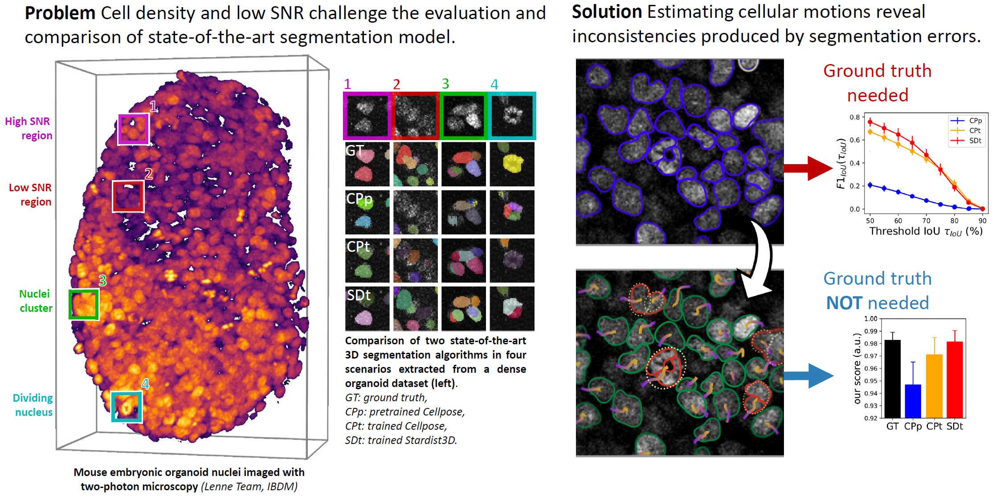

  

# disco-wight (or **Dwight** for short)
## is a **D**etector-**I**ndependent quality **SCO**re **WI**thout **G**round **T**rut**H**

This repository contains the scripts used in the [paper]  
*A detector-independent quality score for cell segmentation without ground truth in 3D live fluorescence microscopy*, Vanaret et al. (2023)

  

## Installation

Major dependancies to be installed are :
- [numpy] : basic library for array manipulation
- [matplotlib] : basic library to plot figures
- [tifffile] : library to read and write tiff images
- [napari] : 3D image visualizer
- [scipy] : general library for scientific python
- [numba] : library to make python fast

From your main Conda environment (or from a custom one), refer to the dependancies' individual documentations to install them. This can usually be done easily using [pip].

To install the repositiory package:

```bash
# from repo root (the DOT "." is important !!!)
pip install -e .
```

You also need to install the codebase for the software U-track3D from its [repo].

## Data 

The data used in the paper is available at this [link]. *WILL BE MADE AVAILABLE SOON*

## Usage

In the scripts, replace `path_to_root = ...` by the path to the data folder.


[paper]: https://ieeexplore.ieee.org/abstract/document/10123011
[repo]: https://github.com/DanuserLab/u-track3D
<!-- [link]: -->

[pip]: https://pypi.org/project/pip
[numpy]: https://numpy.org
[matplotlib]: https://matplotlib.org
[tifffile]: https://pypi.org/project/tifffile
[napari]: https://napari.org
[scipy]: https://scipy.org/
[numba]: https://numba.pydata.org/
